# JobSeek Architecture

## Overview

JobSeek helps candidates discover, qualify, and track roles across multiple job boards. The platform combines a modern React 19 frontend, a lightweight Node + Hono API server, AWS-managed persistence, and the Wallcrawler automation toolkit for headless browsing and extraction.

<!-- Mermaid source: mermaid/ARCHITECTURE/architecture-overview.mmd -->

The system recently finished its migration away from the legacy Next.js runtime. All customer-facing surfaces now travel through the dedicated API server and the Vite-powered client; the remaining work focuses on infrastructure hardening and incremental feature iterations.

## Component Map

### Web Client (React 19 + TanStack Router)
- Vite-based SPA stored in `src/`
- Routing handled by TanStack Router with data fetching through React Query
- UI layer reuses Shadcn primitives housed in `components/`
- Auth + storage context lifted to `contexts/`
- Builds to static assets that any CDN/edge can serve while proxying API calls to the Hono server

### API Server (Node + Hono)
- Lives in `server/index.ts` and mounts the application router from `lib/server/router.ts`
- Exposes `/api/auth/*` via Auth.js core (Google + Twitter OAuth, session JSON, sign-out) alongside anonymous auth issuance/refresh
- Wallcrawler search orchestration, saved jobs/searches, resume uploads, and profile endpoints now run entirely inside Hono
- Shares domain logic from `lib/` (rate limiting, DynamoDB access, Wallcrawler SDK helpers)

### Auth Utilities
- `lib/auth/auth.server.ts` wires Auth.js handlers into the Hono runtime
- `lib/auth/auth-utils.ts` normalises request/session information for middleware and rate limiting
- `lib/server/auth.ts` provides Hono middleware (`requireAuthenticated`, `requireAuthOrAnonymous`) that refresh anonymous cookies when needed

## Data & Storage Layer

### DynamoDB (Single Table Design)
- Table: `jobseek-users-{environment}` (set via `DYNAMODB_USERS_TABLE`)
- Partition key: `userId`, sort key: `dataType`
- Stores user profile, saved searches/jobs, rate limits, and anonymous refresh secrets
- Global secondary indexes include:
  - `DataTypeIndex` for cross-user lookups
  - `ActiveSearchesIndex` for scheduled runs
  - `BoardVisibilityIndex` for discoverable boards
- TTL used for rate limiting and ephemeral auth artifacts

### S3 Resume Storage
- Bucket: `jobseek-resumes-{environment}-{account}`
- Accepts presigned uploads from the client via `lib/storage/s3.service.ts`
- Versioned with lifecycle policy (transition older versions after 90 days)
- Primary artifact store for resumes and attachments

## Automation & Integrations

### Wallcrawler (Headless Automation)
- `@wallcrawler/stagehand` orchestrates scripted browsing and scraping
- `@wallcrawler/sdk` exposes REST/gRPC helpers consumed by API routes
- Jobs run either on demand (user-triggered) or via scheduled Lambda

### Scheduled Processing (EventBridge + Lambda)
- EventBridge rule triggers the search scheduler Lambda (Node 18) on a cadence
- Lambda queries active searches in DynamoDB, executes Wallcrawler flows, persists results, and updates status
- Additional rules planned for notifications and cleanup

### Secrets & Configuration
- AWS Secrets Manager stores OAuth credentials, Wallcrawler keys, and runtime secrets
- CDK synthesises parameter stores and IAM policies per environment

## Observability

- CloudWatch dashboards monitor DynamoDB throughput, Lambda invocations, search success rate, and API latency
- CloudWatch alarms notify on throttling, error spikes, or failed builds
- Application logs (Hono and Lambda) aggregate in CloudWatch Logs with structured metadata for tracing user/session IDs

## Authentication Architecture

- Auth.js core issues OAuth sessions; handlers reside in `lib/auth/auth.server.ts`
- Anonymous access: JWT cookies issued by `/api/auth/anonymous` with refresh rotation stored in DynamoDB (`lib/auth/anonymous.ts`)
- Hono middleware refreshes anonymous tokens opportunistically and enforces guards on every API route
- The React app’s `AuthProvider` consumes `/api/auth/session` responses through `contexts/auth-context.tsx`

## Deployment Model

- AWS CDK now provisions DynamoDB, S3, IAM, EventBridge, Lambda, the S3 static site bucket, CloudFront distribution, and the Lambda@Edge runtime for Hono
- CloudFront serves the Vite SPA from S3 and forwards `/api/*` traffic to the Hono Lambda@Edge handler
- Scheduled jobs continue to run from standard regional Lambdas (search scheduler) while interactive traffic stays at the edge

## Migration Checklist

- [x] Port auth/session endpoints from `app/api/auth/**` to Hono, including Auth.js replacement
- [x] Port Wallcrawler search/session routes to Hono
- [x] Port resume upload + job management endpoints
- [x] Replace `middleware.ts` with Hono equivalents (rate limit + auth guards)
- [x] Update React client hooks to consume the new API responses
- [x] Align infrastructure/CDK to deploy the Hono server + Vite bundle
- [ ] Retire remaining legacy Amplify deployment once the new pipeline ships

Refer to `docs/DEPLOYMENT_GUIDE.md` for environment setup and to `docs/AUTH_ARCHITECTURE.md` for deeper detail on the auth flow.
