# Authentication Architecture

JobSeek supports two classes of access: fully authenticated users (OAuth sign-in) and anonymous browsers (cookie-based JWT). The recent Hono migration consolidated every auth concern inside the Node server while keeping the legacy session shape that the React app expects.

## Current State

- **OAuth sessions (Hono + Auth.js)**: `lib/auth/auth.server.ts` configures Auth.js core and its callbacks. `server/index.ts` proxies `/api/auth/*` requests (except anonymous flows) directly to that handler.
- **Anonymous sessions**: `/api/auth/anonymous` and `/api/auth/anonymous/refresh` issue and rotate cookies using helpers from `lib/auth/anonymous.ts` and DynamoDB persistence in `lib/db/dynamodb.service.ts`.
- **Middleware**: `lib/server/auth.ts` exposes `requireAuthenticated` and `requireAuthOrAnonymous` Hono middlewares. They normalise auth state, refresh anonymous cookies, and attach the session to the request context.
- **Client contract**: `contexts/auth-context.tsx` fetches `/api/auth/session` through `AuthProvider`, hydrating TanStack Router routes and React Query caches. Anonymous refresh logic in `lib/auth/anonymous-client.ts` keeps cookies in sync with the browser.
- **Rate limiting**: `lib/auth/rate-limiter.ts` reuses the auth helpers to build per-user identifiers for session/search/apply limits. Anonymous issuance and refresh endpoints have their own guards.

<!-- Mermaid source: mermaid/AUTH_ARCHITECTURE/auth-flow.mmd -->

## Target State

1. **Session Unification**
- Keep using Auth.js core and finish replacing legacy UI dependencies with framework-agnostic implementations.
   - Ensure `/api/auth/session` stays aligned with `contexts/auth-context.tsx` expectations when new profile fields ship.

2. **Anonymous Flow Enhancements**
   - Surface anonymous token expiry metadata to the client so UX can prompt sign-in before runs expire.
   - Extend refresh endpoints with structured error codes for better toast messaging.

3. **Infrastructure Readiness**
   - Extract Auth.js secret provisioning into CDK (currently pushed via deploy scripts).
   - Vet cookie security defaults for non-AWS hosting targets (Cloudflare Workers, etc.).

## Anonymous Token Flow

1. Client calls `/api/auth/anonymous`.
2. Server generates a short-lived access token plus hashed refresh token (`lib/auth/anonymous.ts`).
3. Refresh secrets persist in DynamoDB with TTL; both cookies are issued via `setCookie` helpers in `server/index.ts`.
4. Subsequent API calls run through `requireAuthOrAnonymous`, which verifies the access token and refreshes it opportunistically.
5. `/api/auth/anonymous/refresh` rotates the refresh secret, reissues both cookies, and updates DynamoDB.

See [`docs/jwt-token-lifecycle.md`](./jwt-token-lifecycle.md) for timing details.

## Key Modules

| File | Responsibility |
| ---- | -------------- |
| `lib/auth/auth.server.ts` | Auth.js core configuration and `getSessionFromRequest` helpers |
| `lib/auth/auth-utils.ts` | Normalises `Request`/`RequestContext` for middleware and rate limiting |
| `lib/auth/anonymous.ts` | Anonymous JWT creation, verification, and rotation logic |
| `lib/auth/anonymous-client.ts` | Browser helper that syncs anonymous cookies and local storage |
| `lib/server/auth.ts` | Hono middleware + auth state accessors |
| `lib/auth/rate-limiter.ts` | Tier configuration and DynamoDB-backed rate limiting |

## Migration Tasks

- [x] Replace NextAuth handlers with Auth.js core inside Hono
- [x] Move anonymous auth endpoints to the Hono server
- [x] Rebuild route guards as Hono middleware
- [x] Update client contexts/hooks to match the new API contracts
- [x] Remove remaining Next.js-only imports from the component layer
- [ ] Automate secret delivery for Auth.js and anonymous flows in CDK

The application no longer depends on the Next.js runtime for auth, and the component layer is now fully framework-agnostic. Legacy `"use client"` directives and any implicit Next.js hooks have been removed so the codebase builds cleanly under the Vite + Hono toolchain.
