# JobSeek Deployment & Environment Guide

The project now runs as a split architecture: a standalone Node + Hono API server and a Vite-built React client. This guide captures how to run the system today and the remaining work to productionise the new stack.


<!-- Mermaid source: mermaid/DEPLOYMENT_GUIDE/deployment-overview.mmd -->

## Local Development

### 1. Install Dependencies
```bash
pnpm install
```
> The repository uses pnpm workspaces and links to packages inside the sibling `wallcrawler` repo. Ensure `../wallcrawler` exists so the links resolve.

### 2. Environment Variables
Create a `.env.local` at the repository root:
```bash
cp .env.example .env.local
```
Populate the variables for OAuth providers, anonymous token secret, Wallcrawler keys, and AWS credentials. Both the Hono server and the React client rely on the same set.

### 3. Run the Services
Start the API server (terminal 1):
```bash
pnpm server:dev
```
Start the web client (terminal 2):
```bash
pnpm client:dev
```
Visit `http://localhost:5173`. Vite proxies `/api/*` requests to `http://localhost:3000` where the Hono server runs. Auth, Wallcrawler orchestration, saved jobs, resumes, and profile endpoints all live inside `lib/server/router.ts`.

Optional scripts:
- `pnpm server:start` – run the API server without file watching
- `pnpm client:build` – produce a production bundle for the React app
- `pnpm client:preview` – preview the built assets locally
- `pnpm mermaid:generate` – render documentation diagrams

## Environment Configuration

### Required Variables
```env
# Auth.js session configuration
APP_ORIGIN=http://localhost:5173
AUTH_REDIRECT_ALLOWLIST=http://localhost:5173
AUTH_SECRET=change-me

# OAuth Providers
GOOGLE_CLIENT_ID=
GOOGLE_CLIENT_SECRET=
TWITTER_CLIENT_ID=
TWITTER_CLIENT_SECRET=

# Anonymous JWT
ANONYMOUS_JWT_SECRET=change-me

# Wallcrawler
WALLCRAWLER_API_URL=
WALLCRAWLER_API_KEY=
WALLCRAWLER_PROJECT_ID=
ANTHROPIC_API_KEY=

# AWS (DynamoDB, S3, rate limiting)
AWS_REGION=us-east-1
AWS_ACCESS_KEY_ID=
AWS_SECRET_ACCESS_KEY=
DYNAMODB_USERS_TABLE=jobseek-users
S3_RESUME_BUCKET=jobseek-resumes

# Optional client config
VITE_APP_ENV=local
DEBUG=false

# Optional rate limiter tuning
# RATE_LIMIT_ANON_SESSION_MAX=30
# RATE_LIMIT_ANON_SESSION_WINDOW_MS=3600000
# RATE_LIMIT_ANON_REFRESH_MAX=240
# RATE_LIMIT_ANON_REFRESH_WINDOW_MS=300000
```

> Set `APP_ORIGIN` to the public URL of the client (for example your CloudFront domain in staging/production) and mirror any additional domains in `AUTH_REDIRECT_ALLOWLIST` so Auth.js redirects back to the SPA after login.
> Use the `RATE_LIMIT_*` overrides to raise limits in lower environments or during load testing while keeping production defaults focused on spam mitigation.

### Files to Create Per Environment
- `.env.local` – local development
- `.env.dev`, `.env.staging`, `.env.prod` – values consumed by CDK pipelines or deployment scripts

## AWS Infrastructure (CDK)

The `cdk/` workspace now provisions both the shared data plane and the customer-facing surfaces:
- DynamoDB table (`jobseek-users-*`)
- S3 resume bucket (`jobseek-resumes-*`)
- EventBridge rules + Lambda scheduler for Wallcrawler jobs
- Secrets Manager entries for third-party credentials
- S3 bucket + CloudFront distribution for the Vite client
- Lambda@Edge function that runs the Hono API

Common commands:
```bash
pnpm --filter @jobseek/cdk cdk:synth       # review CloudFormation template
pnpm --filter @jobseek/cdk cdk:diff        # compare with deployed stacks
pnpm --filter @jobseek/cdk cdk:dev         # deploy backend + web stacks to dev
```

> The deploy script builds the Vite client (`pnpm build:deploy`) before pushing assets to S3. Make sure the `dist/` directory exists or the CDK synthesis will fail.

## Production Deployment Status

| Area | Current Behavior | Remaining Work |
| ---- | ----------------- | -------------- |
| API hosting | Hono server packaged as Lambda@Edge and attached to CloudFront | Harden secret rotation + runtime observability |
| Client hosting | React SPA deployed to versioned S3 bucket behind CloudFront | Automate cache-busting/invalidation from CI |
| Auth | Auth.js core + anonymous flow entirely handled inside Hono | Confirm OAuth configs per environment and lock cookie policies |
| CI/CD | GitHub Actions workflow builds + deploys on `main` | Add approvals/notifications + staging promotion once ready |

## GitHub Actions CI/CD

Pushing to `main` triggers `.github/workflows/deploy.yml`, which:
- runs the build job (`pnpm lint`, `pnpm client:build`, `pnpm --filter @jobseek/cdk build`) on Ubuntu using Node 20 + pnpm 9;
- runs a deploy job that re-installs dependencies, assumes the GitHub OIDC role, and executes `pnpm --filter @jobseek/cdk deploy:dev -- --non-interactive`;
- lets `deploy.sh` download `.env.local` from AWS Secrets Manager (`jobseek/env-file-dev`) before syncing individual secrets and deploying the CDK stacks; no GitHub Actions secrets are required for the env file.

The workflow relies solely on the configured IAM role (`arn:aws:iam::842434829012:role/github-oidc`) and the region declared in the workflow (`AWS_REGION=us-east-1`); no static AWS keys are stored in GitHub.

### Environment secret workflow

1. Maintain the repo-root `.env.local` locally (never commit it).
2. Whenever a value changes, run `pnpm secrets:dev` (shorthand for `pnpm --filter @jobseek/cdk secrets:dev`). The script:
   - reads `.env.local`;
   - syncs individual keys into AWS Secrets Manager (e.g. `jobseek/wallcrawler-api-key`);
   - stores the raw file in `jobseek/env-file-<env>` so CI runners can download it.
3. During CI (or any run where `.env.local` is missing) `deploy.sh` and `deploy-backend.sh` automatically execute:
   ```bash
   aws secretsmanager get-secret-value \
     --secret-id jobseek/env-file-<env> \
     --region <aws-region> \
     --query SecretString --output text > .env.<env>
   ```
   (For dev this writes `.env.local` at the repo root; swap the suffix for `.env.staging`, `.env.prod`, etc. Use `us-east-1` for the current AWS account.)
   Then it continues with the normal deployment flow.

If you ever need to bootstrap a new machine, run the same `aws secretsmanager get-secret-value` command manually and update the file before invoking `pnpm --filter @jobseek/cdk secrets:dev` again.

## Migration To-Do (Deployment)

- [x] Decide on the runtime for the Hono server in production (Lambda@Edge)
- [x] Create build/packaging step for the Hono server (NodejsFunction bundling)
- [x] Publish the Vite client build as part of the deployment pipeline
- [x] Update CDK stacks to remove Amplify and add the new hosting solution
- [x] Revisit environment variable delivery (Secrets Manager for runtime + Vite env injection)
- [ ] Validate that anonymous auth + session refresh work end-to-end once deployed

With Amplify out of the loop the CloudFront + Lambda@Edge stack is now the source of truth. Continue using the deployment scripts locally until the CI pipeline rolls out, and remember to keep `.env.<env>` files in sync so Secrets Manager and Lambda environments stay aligned.
