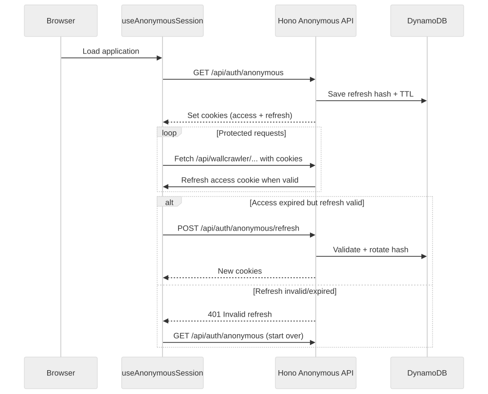

# Anonymous Token Lifecycle

## Overview

JobSeek tracks anonymous visitors with JWT access tokens paired with rotating refresh secrets. The implementation lives entirely in `lib/auth/anonymous.ts` and the handlers inside `server/index.ts`. Tokens keep automation features available to signed-out users without persistent fingerprinting.


<!-- Mermaid source: mermaid/JWT_TOKEN_LIFECYCLE/anonymous-lifecycle.mmd -->

## Token Behavior

### Initial Token Creation (`GET /api/auth/anonymous`)
- Server generates a random anonymous ID and issues a JWT using `ANONYMOUS_JWT_SECRET`.
- Access cookie: `anonymous-token`, 1-day lifetime (`ANONYMOUS_ACCESS_TOKEN_TTL`).
- Refresh cookie: `anonymous-refresh`, 7-day lifetime (`ANONYMOUS_REFRESH_TOKEN_TTL`).
- Refresh metadata (hashed secret, expiry, anonymous ID) persists in DynamoDB via `dynamodbService.saveAnonymousRefreshToken`.

### Background Refresh (`requireAuthOrAnonymous`)
- Every API route guarded by `requireAuthOrAnonymous` verifies the access token.
- When the access token is valid and nearing expiry, the middleware reissues a fresh cookie in-place so active sessions stay alive.

### Manual Refresh (`POST /api/auth/anonymous/refresh`)
1. Client sends refresh cookie (automatically via browser).
2. Server validates the hashed secret stored in DynamoDB.
3. Previous refresh entry is deleted.
4. New refresh secret + access token are generated and saved.
5. Both cookies are reissued with renewed TTLs.

### Expiry Handling
- If both cookies expire or are cleared, the client calls `/api/auth/anonymous` again to restart the flow.
- Invalid refresh tokens trigger a DynamoDB cleanup for the stale entry and respond with `401`.

## Cookie Settings

```typescript
// Access token (anonymous-token)
setCookie(c, ANONYMOUS_ACCESS_COOKIE_NAME, token, {
  httpOnly: true,
  secure: process.env.NODE_ENV === "production",
  sameSite: "Lax",
  maxAge: ANONYMOUS_ACCESS_TOKEN_TTL,
  path: "/",
});

// Refresh token (anonymous-refresh)
setCookie(c, ANONYMOUS_REFRESH_COOKIE_NAME, value, {
  httpOnly: true,
  secure: process.env.NODE_ENV === "production",
  sameSite: "Lax",
  maxAge: ANONYMOUS_REFRESH_TOKEN_TTL,
  path: "/",
});
```

## Token Structure

```typescript
{
  id: string;   // Random hex identifier
  iat: number;  // Issued at (seconds since epoch)
  exp: number;  // Expires at (seconds since epoch)
}
```

## API Endpoints Touching Anonymous Tokens

- `GET /api/auth/anonymous` – issue new anonymous identity
- `POST /api/auth/anonymous/refresh` – rotate refresh secret + access token
- `POST /api/wallcrawler/search/start` (and other guarded routes) – middleware validates and refreshes tokens transparently
- `GET /api/wallcrawler/sessions/:sessionId/stream` – ensures EventSource requests honour anonymous access

User-specific endpoints (profile, saved searches, resume uploads) require authenticated sessions and refuse anonymous tokens.

## Security Notes

- **HttpOnly cookies** protect tokens from XSS.
- **Random IDs** avoid device fingerprinting; identities reset once refresh TTL lapses.
- **Refresh rotation** ensures single-use refresh secrets.
- **DynamoDB TTL** expires stale refresh entries automatically.
- **SameSite=Lax** defends against CSRF while keeping navigation flows usable.

## Client Usage

```typescript
const { ensureAnonymousSession } = useAnonymousSession();

await ensureAnonymousSession();
await fetch("/api/wallcrawler/search/start", {
  method: "POST",
  credentials: "include",
  body: JSON.stringify({ keywords: "react", boards: ["indeed"] }),
});
```

The hook in `lib/auth/anonymous-client.ts` coordinates initial issuance and background refresh so most components do not need to reason about cookies directly.
