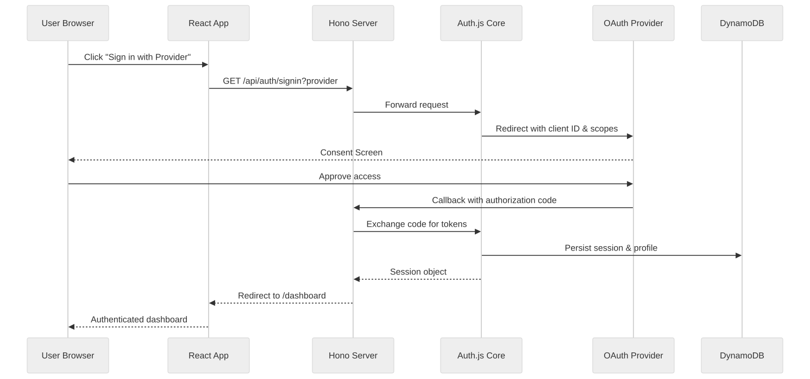

# OAuth Setup Guide for JobSeek

## Overview

JobSeek uses Auth.js (the framework-agnostic successor to NextAuth.js) for OAuth with Google and Twitter providers. The handlers run inside the Hono server (`lib/auth/auth.server.ts`) but retain the familiar `/api/auth/*` endpoints so the React client, Auth.js callbacks, and legacy tooling continue to work.


<!-- Mermaid source: mermaid/OAUTH_SETUP/oauth-handshake.mmd -->

## Google OAuth Setup

### Development Environment
1. Go to [Google Cloud Console](https://console.cloud.google.com/)
2. Create or select a project
3. Enable "Google People API"
4. Go to Credentials → Create Credentials → OAuth client ID
5. Configure the OAuth consent screen
6. Add authorized redirect URIs:
   - `http://localhost:3000/api/auth/callback/google`

### Production Environment
Add the production redirect URI to the same OAuth client or create a dedicated one:
- `https://<your-domain>/api/auth/callback/google`

## Twitter/X OAuth Setup

### Development Environment
1. Go to [Twitter Developer Portal](https://developer.twitter.com/)
2. Create a new app or select an existing one
3. Open "User authentication settings"
4. Enable OAuth 2.0 with PKCE
5. Add callback URLs:
   - `http://localhost:3000/api/auth/callback/twitter`

### Production Environment
Add your production callback URI:
- `https://<your-domain>/api/auth/callback/twitter`

## Environment Variables

All secrets live in `.env.local` for development and in environment-specific files or secret stores for deployed environments.

### Development (.env.local)
```env
# Google OAuth
GOOGLE_CLIENT_ID=your-google-client-id
GOOGLE_CLIENT_SECRET=your-google-client-secret

# Twitter OAuth
TWITTER_CLIENT_ID=your-twitter-client-id
TWITTER_CLIENT_SECRET=your-twitter-client-secret

# Auth.js session configuration
APP_ORIGIN=http://localhost:5173
AUTH_REDIRECT_ALLOWLIST=http://localhost:5173
AUTH_SECRET=$(openssl rand -base64 32)

# Anonymous JWT
ANONYMOUS_JWT_SECRET=$(openssl rand -base64 32)

# Optional: relax anonymous rate limiting during development
# RATE_LIMIT_ANON_SESSION_MAX=500
```

### Production
```env
APP_ORIGIN=https://<your-client-domain>
AUTH_REDIRECT_ALLOWLIST=https://<your-client-domain>
AUTH_SECRET=unique-production-secret
ANONYMOUS_JWT_SECRET=unique-production-anon-secret
GOOGLE_CLIENT_ID=production-google-client-id
GOOGLE_CLIENT_SECRET=production-google-client-secret
TWITTER_CLIENT_ID=production-twitter-client-id
TWITTER_CLIENT_SECRET=production-twitter-client-secret
```

> Separate multiple domains in `AUTH_REDIRECT_ALLOWLIST` with commas (for example `https://app.example.com,https://staging.example.com`). Store these secrets in AWS Secrets Manager or Parameter Store and inject them via CDK or your deployment pipeline.

## Testing the OAuth Flow

1. Start the Hono API server: `pnpm server:dev`
2. Start the React client: `pnpm client:dev`
3. Navigate to `/auth/signin`
4. Click Google or Twitter sign-in
5. Complete the provider flow and confirm the callback hits `/api/auth/callback/<provider>`
6. Verify the UI redirects to `/dashboard`
7. Inspect DynamoDB (`jobseek-users-*`) for the user profile entry

## Common Issues

### "Redirect URI mismatch"
- Ensure callback URLs match exactly (including trailing slashes)
- Check for http vs https and the correct port
- Verify the correct environment variables are loaded

### "Invalid client"
- Double-check client ID and secret values
- Ensure the OAuth app is in production mode (Google) or has the required scopes (Twitter)

## Rate Limits

Most provider dashboards surface rate-limit dashboards. JobSeek also enforces internal limits (see `docs/RATE_LIMITING.md`):
- Anonymous: 50 searches/hour, 20 applications/day
- Authenticated: 100 searches/hour, 50 applications/day
- Premium: 500 searches/hour, 200 applications/day

Keep OAuth credentials separate per environment and rotate them regularly to minimise blast radius if a secret leaks.
