# Rate Limiting System Documentation

## Overview

JobSeek uses a persistent, tier-based rate limiting system built on DynamoDB. Limits are enforced per user/session for the primary Wallcrawler flows (search, session creation, job application) and the anonymous auth endpoints.


<!-- Mermaid source: mermaid/RATE_LIMITING/rate-limit-flow.mmd -->

## How It Works

### Time Window Calculation

Rate limits use fixed windows that align to deterministic boundaries:

- **Hourly limits**: Align to the start of each hour (e.g., 14:00, 15:00)
- **Daily limits**: Align to midnight UTC

```typescript
const windowStart = Math.floor(now / config.windowMs) * config.windowMs;
const resetTime = windowStart + config.windowMs;
```

### Storage Structure

Rate limits are stored in the `DYNAMODB_USERS_TABLE` DynamoDB table using composite keys:

| userId                | dataType                   | count | resetTime     | ttl        |
| --------------------- | -------------------------- | ----- | ------------- | ---------- |
| `search:user:123`     | `RATE_LIMIT#1704067200000` | 45    | 1704070800000 | 1704074400 |
| `apply:anon:anon_abc` | `RATE_LIMIT#1704067200000` | 12    | 1704153600000 | 1704157200 |

- **userId**: `{limitType}:{scope}:{id}` where `scope` is `user`, `anon`, or a custom bucket
- **dataType**: `RATE_LIMIT#{windowStart}`
- **count**: Number of requests in the current window
- **resetTime**: Millisecond timestamp when the window expires
- **ttl**: DynamoDB TTL for automatic cleanup (seconds)

### User Identification

#### Anonymous Users

- Identified by anonymous token ID (e.g., `anon_<tokenId>`)
- `checkAnonymousTokenIssueRateLimit` falls back to the caller IP when no token is present

#### Authenticated Users

- Identified by Auth.js session user ID (`session.user.id`)
- Format: `session:user:{userId}`, `search:user:{userId}`, etc.

#### Premium Users

- Share the authenticated format but switch to the `premium` tier when `subscriptionTier === "premium"` and the subscription is active (`subscriptionExpiry > Date.now()`)

## Rate Limit Tiers

### Anonymous Users

- **Sessions**: 30 per hour (defaults; configurable via `RATE_LIMIT_ANON_SESSION_MAX`)
- **Searches**: 50 per hour
- **Applications**: 20 per day

### Authenticated Users (Free)

- **Sessions**: 10 per hour
- **Searches**: 100 per hour
- **Applications**: 50 per day

### Premium Users

- **Sessions**: 50 per hour
- **Searches**: 500 per hour
- **Applications**: 200 per day

> **Configuration overrides:** All anonymous session/refresh limits can be tuned with `RATE_LIMIT_ANON_SESSION_MAX`, `RATE_LIMIT_ANON_SESSION_WINDOW_MS`, `RATE_LIMIT_ANON_REFRESH_MAX`, and `RATE_LIMIT_ANON_REFRESH_WINDOW_MS`. Defaults are generous in non-production environments to avoid blocking manual testing while keeping production focused on spam prevention.

## Implementation Details

### Atomic Operations

The system uses DynamoDB conditional writes:

```typescript
// First request creates the entry
ConditionExpression: "attribute_not_exists(userId) AND attribute_not_exists(dataType)";

// Subsequent requests increment atomically
UpdateExpression: "SET #count = #count + :inc";
ConditionExpression: "#count < :max";
```

### Race Condition Handling

If two requests create the same entry, the second receives `ConditionalCheckFailedException` and the helper retries automatically.

### TTL Cleanup

Entries set a TTL one hour beyond the reset time:

```typescript
ttl: Math.floor(resetTime / 1000) + 3600;
```

This keeps the table lean while preserving short-term audit data.

## API Integration

### Example: Wallcrawler Search Start (Hono)

```typescript
import { checkSearchRateLimit } from "@/lib/auth/rate-limiter";
import { requireAuthOrAnonymous } from "@/lib/server/auth";

api.post("/wallcrawler/search/start", requireAuthOrAnonymous(), async (c) => {
  const rateLimit = await checkSearchRateLimit(c.req.raw);

  if (!rateLimit.allowed) {
    const retryAfter = Math.max(0, Math.ceil((rateLimit.resetTime - Date.now()) / 1000));
    c.header("Retry-After", retryAfter.toString());
    return c.json({ error: "Rate limit exceeded" }, 429);
  }

  // Continue with search orchestration…
});
```

### Response Contract

When throttled, the helpers return:

- `allowed`: `false`
- `limit`: maximum requests for the window
- `remaining`: `0`
- `resetTime`: epoch milliseconds of the next window

Use these values to populate response headers (`Retry-After`) and JSON payloads.

## Premium Subscription Check

Premium upgrades are validated on every request:

```typescript
async function isPremiumUser(userId: string | null): Promise<boolean> {
  if (!userId) return false;
  const profile = await dynamodbService.getUserProfile(userId);

  return (
    profile?.subscriptionTier === "premium" &&
    !!profile.subscriptionExpiry &&
    new Date(profile.subscriptionExpiry) > new Date()
  );
}
```

## Error Handling

If DynamoDB calls fail, the helper logs the error and returns `allowed: false` with the configured limit. Callers should treat this the same as hitting the limit to avoid bursts when the data plane is unhealthy.

## Testing Rate Limits

### Anonymous Sessions

```bash
for i in {1..6}; do
  curl -X GET --include http://localhost:3000/api/auth/anonymous
done
# The 6th request returns 429
```

### Authenticated Search Limit

1. Sign in through the UI so cookies are set.
2. Run the following (the endpoint returns 429 on the 101st attempt):

```bash
for i in {1..101}; do
  curl -X POST --cookie "$(pbpaste)" \
    -H 'Content-Type: application/json' \
    -d '{"keywords":"react","boards":["indeed"],"location":"remote"}' \
    http://localhost:3000/api/wallcrawler/search/start
done
```

Replace `$(pbpaste)` with session cookies exported from your browser.

### Premium Verification

1. Update the user profile in DynamoDB (`subscriptionTier = "premium"`, `subscriptionExpiry` in the future).
2. Repeat the search loop above and observe the higher thresholds before 429s appear.

Rate limits are defined in `lib/auth/rate-limiter.ts`. Update both documentation and code together whenever tiers or identifiers change.
